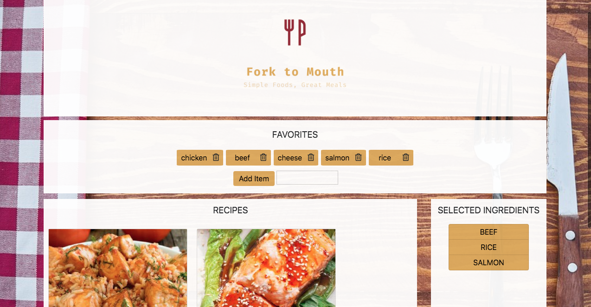

# Fork To Mouth Recipe Finder

**Group Members:** Sally Beckwith, Keanu Korkor, Ben Leone, Herbie Molina

## Description

- In this activity you will take part in application that helps decided what to eat. This will make sure no matter what you have in your fridge. You could still make a good meal out of it.

## Instructions

- You will need enter the app and you should see a modal pop up

  - From there you will select the ingredients you want to use and then press search recipes.

- A few recipes will pop up, if you want to delete an ingredient you will just need to click on it and it will disappear.

  - If you want to add an ingredient you will just need to type in what you would like and it should pop up in to your selected ingredients cart.

- You will select which recipe you like and it will populate a screen with the instructions how to make it.
  Collapse

## Deployed Link

[Fork To Mouth](https://sallyb1988.github.io/RecipeFinder/)

## Screenshot

